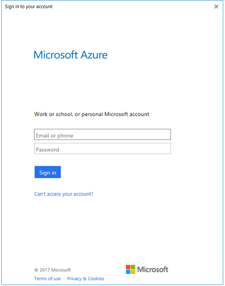

# Authenticating your application against Azure Active Directory

## Overview
When building an application that uses the .NET SDK for Data Lake Analytics (ADLA), you need to pick how your application will sign in to Azure Active Directory (AAD). 

There are two fundamental ways to have your application sign-in:
* **Interactive** - Use this method when your application has a user directly using your application and your app needs to perform operations in the context of that user.
* **Non-interactive** - Thus this method when your application is not meant to interact with ADLA as a specific user. This is useful for long-running services.

## Required NuGet packages

 * [Microsoft.Rest.ClientRuntime.Azure.Authentication](https://www.nuget.org/packages/Microsoft.Rest.ClientRuntime.Azure.Authentication) - v2.3.1
 * [Microsoft.Azure.Management.DataLake.Analytics](https://www.nuget.org/packages/Microsoft.Azure.Management.DataLake.Analytics) - v3.0.0
 * [Microsoft.Azure.Management.DataLake.Store](https://www.nuget.org/packages/Microsoft.Azure.Management.DataLake.Store) - v2.2.0

You can install these packages via the NuGet commane line with the following commands:

```
Install-Package -Id Microsoft.Rest.ClientRuntime.Azure.Authentication  -Version 2.3.1
Install-Package -Id Microsoft.Azure.Management.DataLake.Analytics  -Version 3.0.0
Install-Package -Id Microsoft.Azure.Management.DataLake.Store  -Version 2.2.0
```


## Required NuGet packages

To simplify the code samples, ensure you have the following `using` statements at the top of your C# code.

```
using System;
using System.IO;
using System.Threading;
using System.Security.Cryptography.X509Certificates;

using Microsoft.Rest;
using Microsoft.Rest.Azure.Authentication;
using Microsoft.Azure.Management.DataLake.Analytics;
using Microsoft.Azure.Management.DataLake.Analytics.Models;
using Microsoft.Azure.Management.DataLake.Store;
using Microsoft.Azure.Management.DataLake.Store.Models;
using Microsoft.IdentityModel.Clients.ActiveDirectory;
```


## Basic flow

Your code needs to get credentials (tokens) for each end Azure REST endpoint (token audience) that you intend to use.

These are the Azure REST endpoints (token audiences):

* Azure Resource Manager operations: ``https://management.core.windows.net/``. 
* Data plane operations: ``https://datalake.azure.net/``.

```
public static Program
{
   public static string DOMAIN = "microsoft.onmicrosoft.com";
   public static System.Uri ARM_TOKEN_AUDIENCE = new System.Uri( @"https://management.core.windows.net/");
   public static System.Uri ADL_TOKEN_AUDIENCE = new System.Uri( @"https://datalake.azure.net/" );

   static void Main(string[] args)
   {
      // some preparation steps
      var armCreds = GetCredsInteractivePopup(DOMAIN, ARM_TOKEN_AUDIENCE, tokenCache);
      var adlCreds = GetCredsInteractivePopup(DOMAIN, ADL_TOKEN_AUDIENCE, tokenCache);
      // use the creds to create REST client obkects
   }
}
```

# Interactive Login options

There are two ways to use interactive login:
* Interactive **Pop-up** - The device the user is using will see a prompt appear and will use that prompt.
* Interactive **Device code** - The device the user is using will NOT see a prompt. This is useful in those cases when, for example, it is not possible to show a prompt. This document does not cover this case yet.


## Interactive - User popup - Authentication  
Use this option if you want to have a browser popup appear when the user signs in to your application, showing an AAD login form. From this interactive popup, your application will receive the tokens necessary to use the Data Lake Analytics .NET SDK on behalf of the user.

   


The token cache minimizes the number of times the users sees a pop-up.

```
// for interactive cases
public static string MY_DOCUMENTS= System.Environment.GetFolderPath( System.Environment.SpecialFolder.MyDocuments);
public static string TOKEN_CACHE_PATH = System.IO.Path.Combine(MY_DOCUMENTS, "my.tokencache");
public static string INTERACTIVE_CLIENTID = "1950a258-227b-4e31-a9cf-717495945fc2";

static void Main(string[] args)
{
   var tokenCache = GetTokenCache(TOKEN_CACHE_PATH);
   var armCreds = GetCredsInteractivePopup(DOMAIN, ARM_TOKEN_AUDIENCE, tokenCache);
   var adlCreds = GetCredsInteractivePopup(DOMAIN, ADL_TOKEN_AUDIENCE, tokenCache);
   // use the creds to create REST client obkects
}
```

# Non-interactive login options

Non-interactive - Service principal / application
 * Using a secret key
 * Using a certificate

```
// for non-interactive cases
public static string NONINTERACTIVE_CLIENTID = "xxxxxxxx-xxxx-xxxx-xxxx-xxxxxxxxxxxx";
public static string NONINTERACTIVE_SECRETKEY = ".....";
public static X509Certificate2 NONINTERACTIVE_CERT = 
   new X509Certificate2(@"<path to (PFX) certificate file>", 
   "<certificate password>");

```

## For more information

See  [Azure's .NET SDK for client authentication](https://www.nuget.org/packages/Microsoft.Rest.ClientRuntime.Azure.Authentication)


> NOTE: The code below stores the token cache to the local machine in plaintext. We recommend writing and reading to a more secure format or location; you can use Data Protection APIs as a more secure approach. [See this blog post for more information](http://www.cloudidentity.com/blog/2014/07/09/the-new-token-cache-in-adal-v2/).


## Interactive - Device code - Authentication

Azure Active Directory also supports a form of authentication called "device code" authentication. Using this, you can direct your end-user

## Non-interactive - Service principal / application - Authentication

Use this option if you want to have your application authenticate against AAD using its own credentials, rather than those of a user. Using this process, your application will receive the tokens necessary to use the Data Lake Analytics .NET SDK as a service principal, which represents your application in AAD.

You will first need to provision a service principal (also known as a registered application) in AAD. To create a service principal with a certificate or a secret key, [follow the steps in this article](https://docs.microsoft.com/en-us/azure/azure-resource-manager/resource-group-authenticate-service-principal).

The service principal, just like a user, will need to have appropriate permissions in order for your application to perform certain actions. Regardless of whether a user is the one running your application, the service principal's credentials will be used, and the user's credentials will not be used. To understand the different permissions involved when using Data Lake Analytics, see [Add a new user](https://docs.microsoft.com/azure/data-lake-analytics/data-lake-analytics-manage-use-portal#add-a-new-user).

Here's a code snippet showing how your application can authenticate as a service principal that uses a secret key:

```
static void Main(string[] args)
{
  var armCreds = GetCredsServicePrincipalSecretKey(DOMAIN, armTokenAudience, NONINTERACTIVE_CLIENTID, NONINTERACTIVE_SECRETKEY);
  var adlCreds = GetCredsServicePrincipalSecretKey(DOMAIN, adlTokenAudience, NONINTERACTIVE_CLIENTID, NONINTERACTIVE_SECRETKEY);
}
```


```
private static ServiceClientCredentials GetCredsServicePrincipalSecretKey(
   string domain, 
   Uri tokenAudience, 
   string clientId, 
   string secretKey)
{
  SynchronizationContext.SetSynchronizationContext(new SynchronizationContext());

  var serviceSettings = ActiveDirectoryServiceSettings.Azure;
  serviceSettings.TokenAudience = tokenAudience;

  var creds = ApplicationTokenProvider.LoginSilentAsync(domain, clientId, secretKey, serviceSettings).GetAwaiter().GetResult();
  return creds;
}
```

Here's a code snippet showing how your application can authenticate as a service principal that uses a certificate:

```
static void Main(string[] args)
{
  var armCreds = GetCredsServicePrincipalSecretKey(domain, armTokenAudience, NONINTERACTIVE_CLIENTID, NONINTERACTIVE_CERT);
  var adlCreds = GetCredsServicePrincipalSecretKey(domain, adlTokenAudience, NONINTERACTIVE_CLIENTID, NONINTERACTIVE_CERT);
}
```

```
private static ServiceClientCredentials GetCredsServicePrincipalCertificate(string domain, Uri tokenAudience, string clientId, X509Certificate2 certificate)
{
  SynchronizationContext.SetSynchronizationContext(new SynchronizationContext());

  var clientAssertionCertificate = new ClientAssertionCertificate(clientId, certificate);
  var serviceSettings = ActiveDirectoryServiceSettings.Azure;
  serviceSettings.TokenAudience = tokenAudience;

  var creds = ApplicationTokenProvider.LoginSilentWithCertificateAsync(domain, clientAssertionCertificate, serviceSettings).GetAwaiter().GetResult();
  return creds;
}
```

## Setting up and using Data Lake SDKs
Once your have followed one of the approaches for authentication, you're ready to set up your ADLA .NET SDK client objects, which you'll use to perform various actions with the service. Remember to use the right tokens/credentials with the right clients: use the ADL credentials for data plane operations, and use the ARM credentials for resource- and account-related operations.

You can then perform actions using the clients, like so:

```
static void Main(string[] args)
{
  string adlaAccountName = "<ADLA account name>";
  string resourceGroupName = "<resource group name>";
  string subscriptionId = "<subscription ID>";

  ...

  var adlaAccountClient = new DataLakeAnalyticsAccountManagementClient(armCreds);
  adlaAccountClient.SubscriptionId = subscriptionId;
  var adlsAccountClient = new DataLakeStoreAccountManagementClient(armCreds);
  adlsAccountClient.SubscriptionId = subscriptionId;

  var adlaCatalogClient = new DataLakeAnalyticsCatalogManagementClient(adlCreds);
  var adlaJobClient = new DataLakeAnalyticsJobManagementClient(adlCreds);
  var adlsFileSystemClient = new DataLakeStoreFileSystemManagementClient(adlCreds);

  var account = adlaAccountClient.Account.Get(resourceGroupName, adlaAccountName);

  Console.WriteLine($"My account's location is: {account.Location}!");
}
```

## Helper functions

### GetTokenCache
```
private static TokenCache GetTokenCache(string path)
{
   var tokenCache = new TokenCache();

   tokenCache.BeforeAccess += notificationArgs =>
   {
       if (File.Exists(path))
       {
           var bytes = File.ReadAllBytes(path);
           notificationArgs.TokenCache.Deserialize(bytes);
       }
   };

   tokenCache.AfterAccess += notificationArgs =>
   {
       var bytes = notificationArgs.TokenCache.Serialize();
       File.WriteAllBytes(path, bytes);
   };
   return tokenCache;
}
```

### GetCredsInteractivePopup
```
private static ServiceClientCredentials GetCredsInteractivePopup(
   string domain, 
   System.Uri tokenAudience, 
   TokenCache tokenCache, 
   PromptBehavior promptBehavior = PromptBehavior.Auto)
{
   SynchronizationContext.SetSynchronizationContext(new SynchronizationContext());

   var clientSettings = new ActiveDirectoryClientSettings
   {
       ClientId = INTERACTIVE_CLIENTID,
       ClientRedirectUri = new System.Uri("urn:ietf:wg:oauth:2.0:oob"),
       PromptBehavior = promptBehavior
   };

   var serviceSettings = ActiveDirectoryServiceSettings.Azure;
   serviceSettings.TokenAudience = tokenAudience;

   var creds = UserTokenProvider.LoginWithPromptAsync(domain, clientSettings, serviceSettings, tokenCache).GetAwaiter().GetResult();
   return creds;
}
```


## Contributing

This project has adopted the [Microsoft Open Source Code of Conduct](https://opensource.microsoft.com/codeofconduct/). For more information see the [Code of Conduct FAQ](https://opensource.microsoft.com/codeofconduct/faq/) or contact [opencode@microsoft.com](mailto:opencode@microsoft.com) with any additional questions or comments. 
